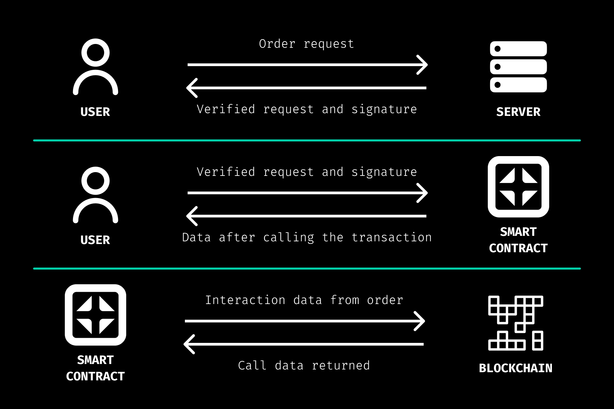

# Executor

## About

DeFiesta introduces an innovative way to execute and manage services through blockchain technology, leveraging the power and security of smart contracts. At the heart of this system is the Executor smart contract, a sophisticated tool designed to facilitate the execution of tasks within the DeFiesta ecosystem. This article delves into the functionality of the Executor contract, explaining how users can interact with DeFiesta services using blockchain technology.

The Executor smart contract serves as the backbone for executing orders within the DeFiesta platform. It is built on the Ethereum blockchain, utilizing EIP-712 for secure and verifiable signing of typed structured data, ensuring that orders are authenticated and executed accurately and securely.

#### The contract features a modular design that includes several key components:

* **Order Management:** Users can create, sign, and submit orders for services.
* **Task Execution:** The contract processes tasks based on verified orders.
* **Discount Mechanism:** It calculates discounts for users based on specific criteria, encouraging engagement and participation within the DeFiesta ecosystem.
* **Security and Permissions:** Leveraging the Ownable contract, it ensures that only authorized users can perform sensitive operations, such as cancelling orders.

## **How It Works**

<figure><figcaption>
Executor functionality
</figcaption></figure>

1. **Order Preparation:** Users initiate a request to the DeFiesta server, providing details for the service they wish to execute. This includes the type of service, any specific parameters, and the intended recipient of the service.
2. **Order Validation and Signing:** Upon receiving a request, the DeFiesta server validates the provided information against its database and rules. Once validated, the server signs the order using its private key, creating a digital signature that attests to the order's authenticity and approval.
3. **Blockchain Submission:** With the signed order, users submit a transaction to the Ethereum blockchain containing the order details and the server's signature. This transaction interacts with the Executor smart contract, which verifies the signature against the order data.
4. **Task Execution:** Once the order is verified and deemed valid, the Executor contract executes the specified task. This could range from transferring tokens as part of a payment for services to invoking other contracts or operations within the DeFiesta ecosystem.
5. **Discount Application:** If applicable, the contract calculates and applies any discounts to the service fee based on the user's eligibility. This process encourages user participation and loyalty by offering financial incentives.
6. **Completion and Event Emission:** Upon successful execution, the contract emits an event detailing the execution outcome. This event can be monitored by users and the DeFiesta platform to confirm that the service was carried out as expected.

## **Security Features**

**EIP-712 Signing:** By requiring orders to be signed according to the EIP-712 standard, the system ensures that orders are explicitly approved by the DeFiesta server, preventing unauthorized or fraudulent orders.

**Order Status Tracking:** The contract maintains the status of each order (active, executed, cancelled) to prevent double-execution and to allow for order cancellations by authorized personnel.

**Permission Checks:** Sensitive operations, such as setting discounts or cancelling orders, are restricted to the contract owner, providing an additional layer of control and security.

The Executor smart contract is a cornerstone of the DeFiesta platform, enabling secure, verifiable, and efficient execution of services within the blockchain space. By combining advanced smart contract functionality with user-friendly processes, DeFiesta is paving the way for a new era of blockchain-based service execution, offering users a seamless and secure way to access and manage services within its ecosystem.
